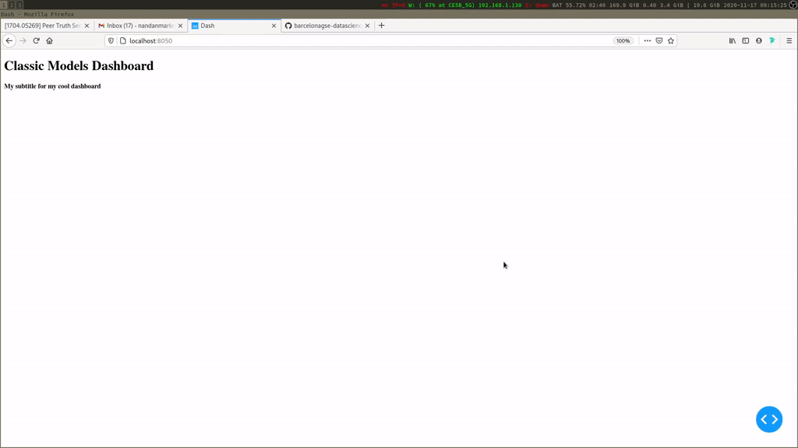
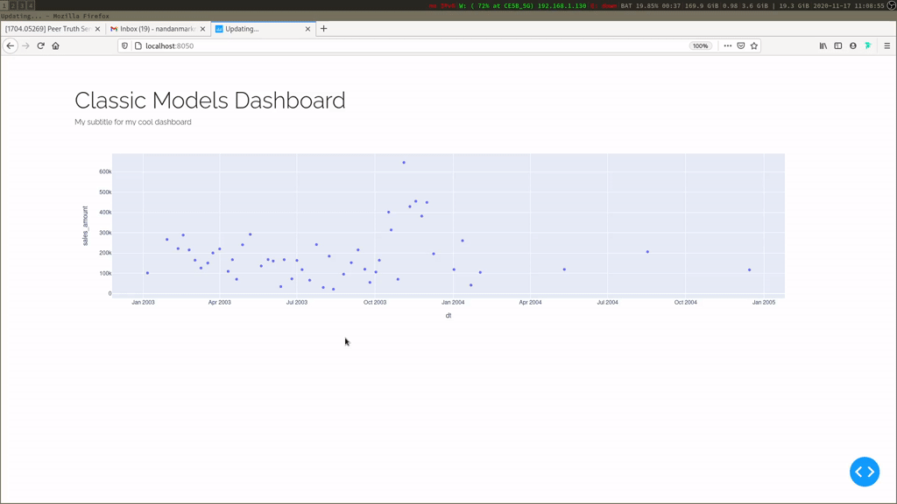
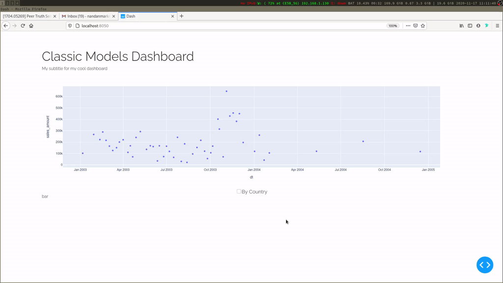
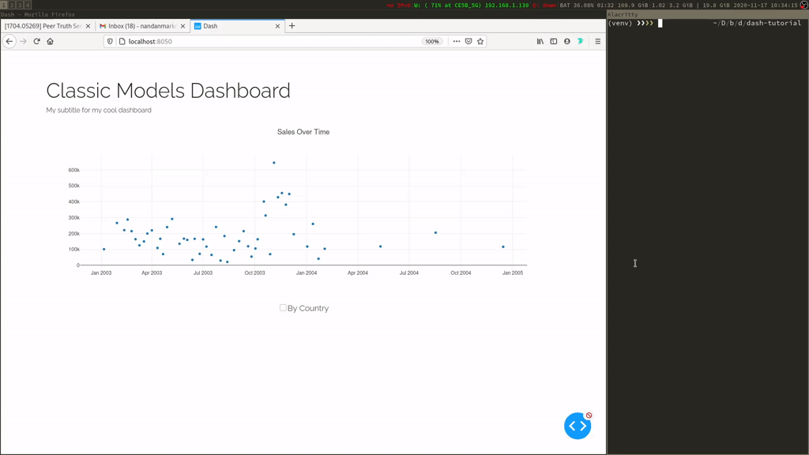
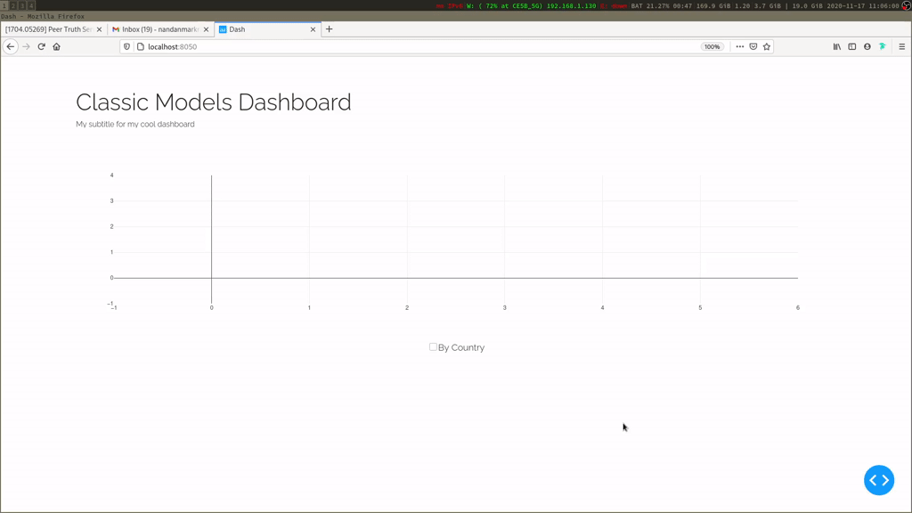
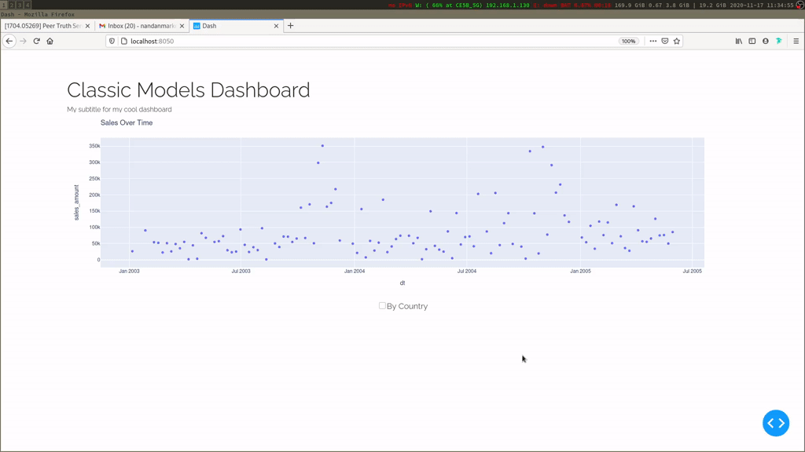

# Dash Tutorial


This tutorial will get you up and running with Dash, a Python framework for dashboards built by the folks at Plotly.

It's worth noting, that if you don't like this tutorial I made, you can always follow the [official tutorial in the Dash documentation](https://dash.plotly.com/) instead!

Our goal will be to create a dashboard on top of the Postgres data warehouse storing our favorite data from Foos Models. We will build a dashboard that views some basic statistics from that database.

## Installation

First you will need to create a new folder and create a virtual environment:

``` shell
mkdir dash-tutorial
cd dash-tutorial
python3 -m venv venv && source venv/bin/activate
```

Now install the following libraries:

``` shell
pip install dash==1.17.0 dash_daq pandas psycopg2-binary records
```

And create an `app.py` file in the root of the project with the following code:

``` python
import dash
import dash_html_components as html


app = dash.Dash('dash-tutorial')

app.layout = html.Div(className='layout', children=[
    html.H1('Classic Models Dashboard'),
    html.H4('My subtitle for my cool dashboard', className='subtitle')
])

app.run_server(debug=True)
```

Try running it with `python app.py` and opening your browser to http://localhost:8050.

You should be able to see your dashboard! Try changing the text in the Python file and saving. You don't need to stop/start the Python process, it auto-reloads the file! You should see the changes reflected in your browser.

## HTML and Styling Basics

Open up the inspector in your browser (usually `CTRL+SHIFT+I`) and then may need to additionally select the "inspector" window.



You will be able to view the HTML that you created. Remember, HTML is a tree and each node is an HTML _element_. HTML elements are defined by "opening tags" and "closing tags"

Try adding new HTML elements in dash (`html.P`) and try inspecting the html in your browser too to see what changes.

Great, now let's make it look a bit better with CSS. First we create an `assets` folder, which Dash will automagically include for us. Next, we add a "CSS reset", which just makes CSS a little easier to work with by getting rid of defaults:

``` shell
mkdir assets
cd assets
touch main.css
wget -O _reset.css https://meyerweb.com/eric/tools/css/reset/reset.css
```

Take a look at the page, you should notice all the default styling has dissapeared! This gives us a "blank slate" to start from and can make it easier for you to reason about what is happening with the styling.

Now, let's style. Modify the `main.css` file to look like:


``` css
@import url('https://fonts.googleapis.com/css?family=Raleway:300,400,600&display=swap');

body {
  font-weight: 300;
  font-family: "Raleway", Helvetica, sans-serif;
  color: #222;
}

h1, h2, h3, h4, h5, h6 {
  font-weight: inherit;
}
```

There are two steps to changing the font. The first is loading it (from Google, for example, as above), which makes a GET request and collects the font information, the second step is declaring it in the CSS itself, which we did when we declared the font-family for the "body". If you remember, HTML is made up of "meta" and "body", with the body containing all the content. So any styling we put on the "body" affects everything we see!

Try to change the font! Take a look at Google Fonts and find one you like.

Note that if we look at the HTML in our inspector, we see that both the H1 and the H4 elements we created are within a div element with the class "layout". We can style that div element with the following CSS:

``` css
.layout {
  width: 85%;
  max-width: 1600px;
  margin: 0 auto;
}
```

Where the `.layout` tells the browser to apply that set of styles to "any element with the class 'layout'".

Try changing the width of your browser, see what happens.

Next, let's try and give the title a bit of breathing room. To do that, let's add a class to the H1 element with the `className` parameter:

``` python
    html.H1(className='title', children='Classic Models Dashboard'),
```

Now we can attach a style to that element by using the class. Write this in your `main.css` file:

``` css
.title {
  font-size: 3em;
  margin: 1.5em 0 0.3em 0;
}
```

That should feel a bit better. You should feel free to play around CSS, it's pretty easy! That being said, it can also get pretty frustrating, so don't lose too much time on fancy styling. You can find a [good tutorial from Mozilla here](https://developer.mozilla.org/en-US/docs/Learn/CSS).

## Components and Plots

Add this to your `app.py`:

``` python
import dash_core_components as dcc
```

The main functionality of Dash comes from these components. You can take a look at their documentation here: https://dash.plot.ly/dash-core-components.

Previously, we just used plain-jane HTML components (H1, Div), but the dash_core_components are supercharged with functionality we will want. These components consist of items on the page that we either want the user to interact with or that we want to display data.

Let's start by adding a `Graph` to our layout. Add this to the `children` parameter of the `app.layout`:

``` python
dcc.Graph(id='timeline', figure={})
```

Do you see the graph on the page?

Now we just need to get some data into that graph. Let's get some data from your Postgres data warehouse!

(HINT: see what happens when you put a `print` statement in your `app.py` file. In will conveniently print in the terminal!)

1. Connect to your data warehouse and get ALL the order facts with their dates and the amount of the sale.

2. Put the data in a pandas dataframe. This can just be a globally available variable for now.

3. The dataframe should look like this:

``` python
             dt sales_amount
0    2003-01-06      4080.00
1    2003-01-06      1729.21
2    2003-01-06      1660.12
3    2003-01-06      2754.50
4    2003-01-09      2701.50
...         ...          ...
2991 2005-05-31      6261.71
2992 2005-05-31       986.42
2993 2005-05-31      3435.39
2994 2005-05-31       553.52
2995 2005-05-31      1708.56
```

Now, put the data into the graph.

First import `plotly.express`:

``` python
import plotly.express as px
```

Now replace the Graph in your layout so that it looks like this, where `df` is your dataframe, `dt` is the datetime column, and `sales_amount` is the sales amount column:

``` python
dcc.Graph(id='timeline',
          figure=px.scatter(df,
                            x='dt',
                            y='sales_amount'))
```

You should see a plot of all the order line items!

Clearly plotting every order fact is not very useful. Let's make it more useful: group some dimension (week or day or order, for example), and sum the sales amounts together so that we have a better sense of how things go over time. Try doing all the data selection work directly in SQL!

I chose to group by week. I think it looks reasonable this way.

(HINT: if you group by week, you should pick a representative "date" for that week to plot by, for example by using the `date_trunc()` function in Postgres).



This is great, but we want some user interaction! For example, maybe we'd like to see this broken out by country.

This is where things get interesting. We will need some way to connect the value of the checkbox to the code that produces the graph. Dash thinks of this as connecting an "Input" to an "Output". The Output will be the graph, the Input will be a checkbox.

The method for connecting the two will be a function to which we apply a special `decorator`. The function allows us to perform any code we want as we translate the data from the Input into data for the output. You can read more about decorators [here](https://www.datacamp.com/community/tutorials/decorators-python), but what you need to know for now is that decorators start with @, are written just before a function, and are themselves functions that can sometimes take arguments.

First, let's create a checkbox that will be used to switch between viewing the aggregated and disaggregated numbers. Add this to your layout:


``` python
html.Div(className='timeline-controls', children=[
    dcc.Checklist(id='country-checkbox',
                  options=[ {'label': 'By Country', 'value': 'by_country'}])
])
```

Now take a look at your page, you should have a checkbox! Examine the HTML in the inspector in the browser.

Let's style the checkbox so that it sits nicer on the page. Take a look at the HTML in the browser inspector. Note we added a div with the class 'timeline-controls', we can use that to move the checkbox around by adding this to our `main.css` file:

``` css
.timeline-controls {
  display: flex;
  justify-content: space-around;
}

.timeline-controls label {
  font-size: 1.2em;
}
```

The first block centers the children of `.timeline-controls` inside of it horizontally, which looks more reasonable. The second block makes any `label` element that is a descendent of `.timeline-controls` have a larger font size.

Ok, great, I like how it look. But click the checkbox still does nothing. Now we will need to create a function that will take care of a our logic. Put the following function somewhere (anywhere after `app` is defined) in your `app.py` file:

``` python

from dash.dependencies import Input, Output

@app.callback(
    Output('foo', 'children'),
    [Input('country-checkbox', 'value')]
)
def timeline(boxes):
    print(boxes)
    return 'foo' if boxes else 'bar'
```

And put this somewhere in your layout:

``` python
html.Div(id='foo')
```

You should see that you can change the content of the div!




Also, you should see the output of "boxes" in your terminal. What happened? Callbacks work like this:

The output takes a `component_id` and `component_property`. Dash will find the component, in the layout, that has that id and change the property defined in property to equal whatever is returned by the function. In this case, we are setting the `children` property of a div element to be a string.

Play around with that simple callback until you feel like you understand what is happening. Use the inspector to see the HTML change.

Now it's time to do some real work. Let's change the output component_id from `foo` to `timeline`, which is our graph, and change the property from `children` to `figure`. Given that we are updating the `figure` attribute of the `timeline` element, we need to return a `figure`.

What is a figure? It's a Plotly concept and you can read more about it [here](https://plotly.com/python/creating-and-updating-figures/?_ga=2.186839784.1713986373.1605601545-25327429.1605470020). But we've already used it! The `px.scatter` function returns a figure, so we can use that:

``` python
@app.callback(
    Output('timeline', 'figure'),
    [Input('country-checkbox', 'value')]
)
def timeline(boxes):
    print(boxes)

    fig = px.scatter(df,
                     x='dt',
                     y='sales_amount')

    fig.update_layout(title='Sales Over Time')

    return fig
```

Now we can make the `dcc.Graph` object in our `layout` look like this again:

``` python
dcc.Graph(id='timeline', figure={})
```

Once we make those two changes, everything should seem exactly as before (it's as though we did nothing!). However, now the function `timeline` is setting the figure in our graph. This is great, because we can now manipulate the figure via the checkbox, which determines the argument `boxes`, which is passed to our function.

Take a look at the print statement to see what Dash is doing:



It's giving you 3 different arguments for the `boxes` parameter:

1. `None`
2. `[]`
3. `[by_country]`

So we can go ahead and return a different figure based on that argument. For example, let's turn the figure off and on. Change the `timeline` function to this:

``` python
def timeline(boxes):
    fig = px.scatter(df,
                     x='dt',
                     y='sales_amount')

    fig.update_layout(title='Sales Over Time')

    if boxes:
        return fig
    return {}
```

And now you should be able to use the checkbox to show or remove the figure from the graph:




Now let's create a plot which has different colors. First, we need to add a `country` column to our dataframe as well:


``` python
    sales_amount         dt    country
0       27695.54 2005-03-23        USA
1       12538.01 2004-09-03         UK
2       15718.61 2003-01-06        USA
3        4465.85 2003-10-02        USA
4       38350.15 2003-09-19      Japan
..           ...        ...        ...
220     46968.52 2005-03-01     France
221      3516.04 2005-03-02      Japan
222     15822.84 2004-11-16      Japan
223     37281.36 2004-06-03  Australia
224     55601.84 2003-07-02        USA
```

So you will need to modify your SQL query to get the extra data (now the sales_amount is grouped by country/week and summed!)

Then we can use it to modify our graph

``` python
def timeline(boxes):
    fig = px.scatter(df,
                     x='dt',
                     y='sales_amount',
                     color='country')

    fig.update_layout(title='Sales Over Time')

    return fig
```

Now, let's make the graph interactive.

Modify your `timeline` function such that, if the `boxes` parameter is not None and contains the string "by_country", it returns a figure with sales per country (as above) and if _not_ then it returns data with all sales summed togther across countries. HINT: you could do either do separate SQL queries or do the work in Pandas!




That looks pretty good. But I actually think it will look better as a bar graph! This is a trivial change, simpley change `px.scatter` to `px.bar` and see how it looks!

## More graphs

Let's create another graph, a simple bar chart, which shows the top selling product. Add this to your layout (after everything else):

``` python
dcc.Graph(id='products', figure = {})
```

Great, now we have two graphs! Let's go about populating this new graph. Let's first get some data. Write a SQL query (almost identical to those you've already done in HW) that gets:

1. The top 10 products, by sales amount. For example, for the, it should look something like this:

``` python
                          product_name   total_sales
0           1992 Ferrari 360 Spider red    276839.98
1                     2001 Ferrari Enzo    190755.86
2              1952 Alpine Renault 1300    190017.96
3  2003 Harley-Davidson Eagle Drag Bike    170686.00
4                     1968 Ford Mustang    161531.48
```


Make that dataframe also a globally available variable. We can now make another function with a callback decorator that ALSO takes the checkboxes as an input:

``` python

@app.callback(
    Output('products', 'figure'),
    [Input('country-checkbox', 'value')]
)
def product_chart(boxes):

    # where products is the name of your dataframe
    data = products.sort_values('total_sales')

    fig = px.bar(data,
                 y='product_name',
                 x='total_sales',
                 orientation='h')

    return fig
```

Cool, now we have a second graph! Notice that this function ignores that `boxes` parameter. You will fix that in the bonus challenge below:


**BONUS CHALLENGE:** Make the products barchart have a similar functionality as the timeline, where you can see the results split by country. To do this you will need to:

1. Write a SQL query that selects the individual country totals for each of your top 10 products.

2. Adjust the `product_chart` function to show diffrent levels of data, similar to what we did in the timeline. You will probably use the `color` parameter, and potentially also the `category_orders` parameter, of the `px.bar` function.


## Multiple Inputs

Callbacks can take multiple inputs, which just become multiple parameters of the function that is decorated!

Let's make a slider so that we can also pick the timeframe that we are interested in. Let's update our "timeline-controls" div in our layout, to add a RangeSlider:

``` python
    html.Div(className='timeline-controls', children=[
        dcc.RangeSlider(
            id='year-slider',
            min=2003,
            max=2005,
            value=[2003, 2005],
            marks = {2003: 'year-2003', 2004: 'year-2004', 2005: 'year-2005'}
        ),
        dcc.Checklist(id='country-checkbox',
                      options=[ {'label': 'By Country', 'value': 'by_country'}])
    ])
```

And we'll add this to the `main.css` to make it look decent:

``` css
.timeline-controls {
  display: flex;
  justify-content: space-around;
  width: 70%;
  margin: 0 auto;
}

#year-slider {
  width: 70%;
}

```

Now we have a range slider! That was mostly to see how it works. Now let's create one that's more continuous. Instead of just years, we'll use "timestamps", which is the number of milliseconds since "epoch" (when Unix was invented!). Write these somewhere in your `app.py` file (note, the file is starting to get busy, maybe you should start splitting it up!):

``` python
from datetime import datetime
from dateutil.relativedelta import relativedelta

def get_marks(start, end):
    result = []
    current = start
    while current <= end:
        result.append(current)
        current += relativedelta(months=3)
    return {int(m.timestamp()): m.strftime('%Y-%m') for m in result}

MIN_TIME = datetime(2003,1,1)
MAX_TIME = datetime(2005,12,31)
```

BONUS: add a small function to get the MIN/MAX time from your Postgres database, from the data, rather than hardcoding it here!

Now adjust the slider:

``` python
dcc.RangeSlider(
    id='year-slider',
    min=MIN_TIME.timestamp(),
    max=MAX_TIME.timestamp(),
    value=[MIN_TIME.timestamp(), MAX_TIME.timestamp()],
    marks = get_marks(MIN_TIME, MAX_TIME)
)
```

Now we have a beautiful slider! Next we need to actually change the data on the page to listen to the slider. We will first add it as an input to our "timeline" function:

``` python
@app.callback(
    Output('timeline', 'figure'),
    [Input('country-checkbox', 'value'),
     Input('year-slider', 'value')]
)
def timeline(boxes, time_range):
    print(time_range)
```

Take a look at what it prints, when you move the slider around! You can use the `fromtimestamp` method on `datetime` to get it back to a datetime object:

``` python
@app.callback(
    Output('timeline', 'figure'),
    [Input('country-checkbox', 'value'),
     Input('year-slider', 'value')]
)
def timeline(boxes, time_range):
    start, finish = [datetime.fromtimestamp(t, tz=timezone.utc) for t in time_range]
    print(start)
    print(finish)
```

Now you can use the start/finish datetime objects to filter your data (either in the SQL query or in the dataframe)!


Do the same for the same for the products!

And now enjoy your beautiful dashboard. You can think about designing how to deal with data, in pandas or in SQL. One nice design:

Make each dataset the result of a function. Use a cache to store the results of the functiona after the first time it is called (sometimes called "memoization") - https://dash.plotly.com/performance.


## Deployment

Under the hood, Dash is using Flask, a popular Python web framework!

`app.server` will recover the flask server itself. Given the flask server, we use other libraries to run the server on multiple threads. One of those is gevent. If you have the dash "app" variable in the module `app.py`, you simply need a `server.py` that looks like this:


```python
from gevent.pywsgi import WSGIServer
from app import app

http_server = WSGIServer(('', 5000), app.server)
http_server.serve_forever()
```

And change your `app.py` to get rid of the `run_server` line:

``` python
app.run_server(debug=True) # delete this line!
```

Now your production code runs `python server.py` and the server is listening on port 5000 (you can change that directly in the code)!
